# RT-Thread 文件系统应用笔记 #

​    本应用笔记介绍了 RT-Thread 文件系统的基本知识和使用方法，帮助开发者更好地使用 RT-Thread 文件系统。并给出了在正点原子 `STM32F429-apollo` 开发板上验证的代码示例。 

## 本文的目的和结构 ##

### 本文的目的和背景 ###

第一次接触 RT-Thread 文件系统的开发者可能觉得 RT-Thread 文件系统过于复杂，不知道该从何入手。想要在项目中使用文件系统，却不知道该怎么做。产生这种印象的原因是对 RT-Thread  DFS 框架没有足够的了解，如果理解了 DFS 框架，在使用 RT-Thread 文件系统时就可以得心应手了。

为了能让开发者清楚地理解 RT-Thread DFS 框架的概念，学会使用 RT-Thread 文件系统。本应用笔记将一步步深入介绍 RT-Thread  DFS 框架的相关知识以及实现原理。通过演示 shell 命令和使用示例的方式来操作文件系统，让开发者能够学会 RT-Thread 文件系统的使用方法。

### 本文的结构 ###

本应用笔记将从以下三个方面来介绍 RT-Thread 文件系统：

- RT-Thread DFS 框架
- RT-Thread 文件系统的移植
- RT-Thread 文件系统的使用

## 问题阐述 ##

本应用笔记将围绕下面几个问题来介绍RT-Thread 文件系统。

- 如何移植各种类型的文件系统？
- 如何对文件系统进行操作？
- 如何在文件系统中对文件和文件夹进行操作？

想要解决这些问题，就要了解 RT-Thread DFS 框架。下面我们就通过 DFS 框架一步一步地将文件系统使用起来。

## 问题的解决 ##

### DFS 框架介绍 ###

RT-Thread 的文件系统采用了三层结构，这种结构就是 RT-Thread DFS 框架。

下图为 **RT-Thread 文件系统结构图** ：

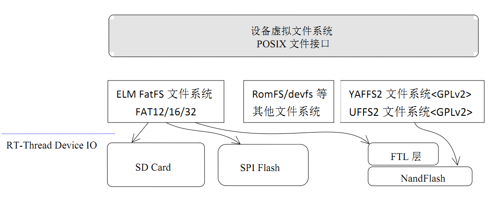 

DFS 框架的最顶层是一套面向嵌入式系统，专门优化过的设备虚拟文件系统 POSIX 文件接口，中间层是各种文件系统的实现，最底层是各类存储设备驱动。

#### DFS 框架的来源 ####

- RT-Thread 为了能够支持各种文件系统，设计了这样一个 DFS 框架，各个层次独立实现，提高了操作系统的可扩展性。使用 DFS 框架可以使得各种文件系统经过简单的修改即可匹配到这个框架上，降低了文件系统移植难度，让 开发者有更多的文件系统类型可供选择。

#### DFS 框架各层次说明  ####
##### 顶层：POSIX 文件接口层 #####

- 这一层是给开发者使用的接口函数层，开发者使用这一层提供的 `POSIX` 文件接口进行文件的相关操作，不用关心文件系统是如何实现的，也不用关心数据是存放在哪个存储器中。

##### 中间层：文件系统实现层 #####

- 中间层是各种具体文件系统的实现，这里所说文件系统指各种不同类型的文件系统，比如 `ELM FatFS、RomFS、devfs、Yaffs2、Uffs2` 等。需要知道的是，不同的文件系统类型是独立于存储设备驱动而实现的。因此，想要正确地使用这些文件系统，需要把底层存储设备的驱动接口和文件系统对接起来。

##### 底层：存储设备驱动层 #####

- 这一层是存储设备驱动层，具体的功能是初始化存储设备并向上层提供存储设备的驱动接口。存储设备的类型可能是 `SPI Flash`，`SD卡` 等。

### 文件系统的移植 ###

- 本次演示使用正点原子开发板 `STM32F429-Apollo` ，选择的文件系统类型是  `elm FatFS`  。由于 RT-Thread 自带了这个文件系统，所以移植工作较为简单，只需要通过 env 工具对系统进行合适的配置既可。其他 RT-Thread 支持的文件系统，移植过程也是类似的，只需要对系统进行合适的配置即可使用。

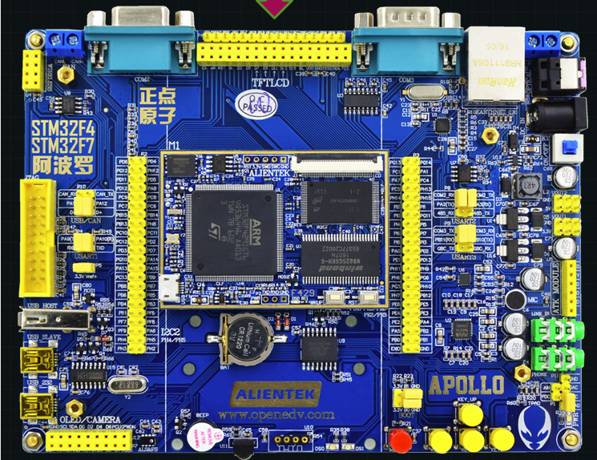

#### 准备工程 ####

- 下载 [RT-Thread 源码](https://github.com/RT-Thread/rt-thread) 。

- [env 工具](https://www.rt-thread.org/document/site/rtthread-development-guide/rtthread-tool-manual/env/env-user-manual/) 

#### 移植过程介绍 ####

文件系统的移植主要包括下面几个方面：

- 开启/配置 DFS 框架
- 开启/配置 指定的文件系统
- 确保开发板上的存储设备驱动正常工作

通过 env 工具可以方便地开启文件系统，将所需的文件系统类型添加到工程中。

对存储设备进行功能测试，可以确保存储设备驱动是正常工作的。驱动程序的稳定工作是文件系统正常使用的基础。

#### 文件系统的配置 ####
使用 env 工具进入 `rt-thread\bsp\stm32f429-apollo` 目录，在命令行中输入 `menuconfig` 命令进入配置界面。

- 在 `menuconfig` 配置界面依次选择 `RT-Thread Components → Device virtual file system`，如下图所示：

  

- 下面介绍 DFS 的配置项：
  - Using device virtual file system ： 使用设备虚拟文件系统，即 RT-Thread 文件系统。
  - Using working directory :  打开这个选项，在 `finsh/msh` 中就可以使用基于当前工作目录的相对路径。
  - The maximal number of mounted file system ：  最大挂载文件系统的数量。
  - The maximal number of file system type ： 最大支持文件系统类型的数量。
  - The maximal number of opened files ：  打开文件的最大数量。
  - Enable elm-chan fatfs ： 使用 elm-chan FatFs。
  - elm-chan's FatFs, Generic FAT Filesystem Module : elm-chan 文件系统的配置项。
  - Using devfs for device objects ： 开启 devfs 文件系统。
  - Enable BSD socket operated by file system API ： 使 BSD socket 可以使用文件系统的 API 来管理，比如读写操作和 select/poll 的 POSIX API 调用。 
  - Enable ReadOnly file system on flash ： 在 Flash 上使用只读文件系统。
  - Enable RAM file system ： 使用 RAM 文件系统。
  - Enable UFFS file system: Ultra-low-cost Flash File System ：使用 UFFS。
  - Enable JFFS2 file system : 使用 JFFS2 文件系统。
  - Using NFS v3 client file system ：使用 NFS 文件系统。

- 进入到 DFS  的配置界面，开启下图所示的选项，就可以将 `FatFS` 添加到系统中。如图所示：

  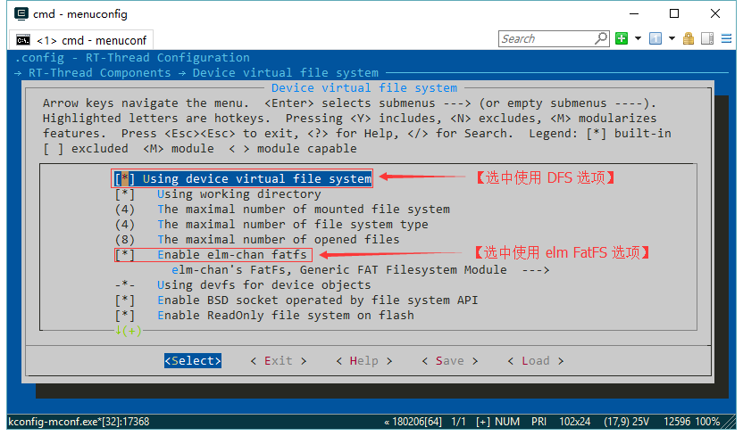

- 这里需要注意的是还需要进入到 `elm-chan's FatFs, Generic FAT Filesystem Module` 选项中修改关于长文件名支持的选项，否则在后面使用文件系统的过程中，创建的文件或者文件夹的名称不能超过 8 个字符。修改方式如下图所示：

  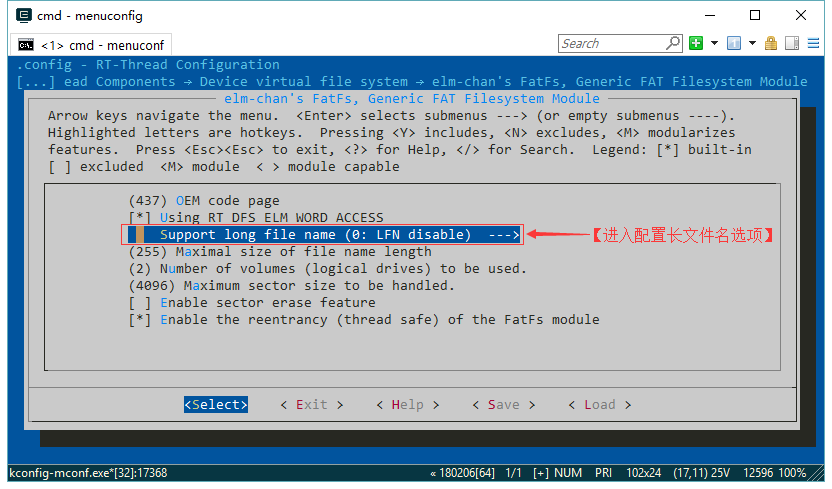

  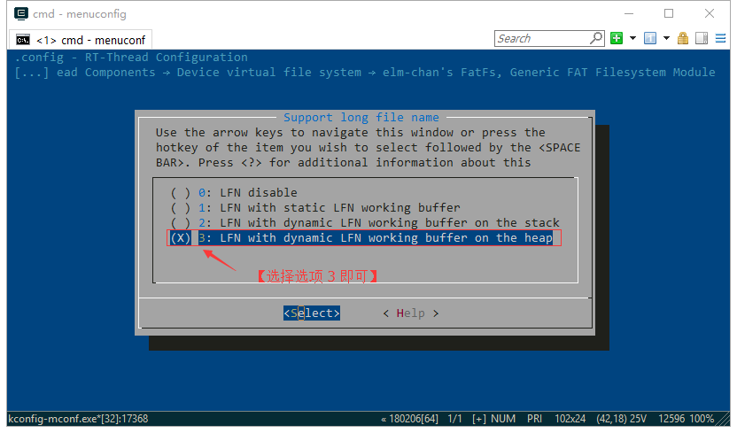

- 因为要使用一些 C 库函数，所以需要打开 `libc` 功能：

  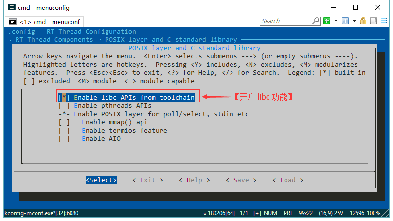

- 保存选项后即可退出，此时 `elm FatFS` 已经添加到项目中 。

#### 存储设备初始化 ####
##### 开启 SPI 设备驱动 #####

- DFS 框架的文件系统实现层需要存储设备驱动层提供驱动接口用于对接，本次使用的存储设备为 `SPI Flash`，底层设备初始化过程可以参考 [《SPI 设备应用笔记》](https://www.rt-thread.org/document/site/rtthread-application-note/driver/spi/an0004-rtthread-driver-spi/) 。

- 重新打开 menuconfig 配置界面，在 `RT-Thread Components → Device Drivers` 界面中选中 `Using SPI Bus/Device device drivers` 以及 `Using Serial Flash Universal Driver` 选项，如下图所示：

  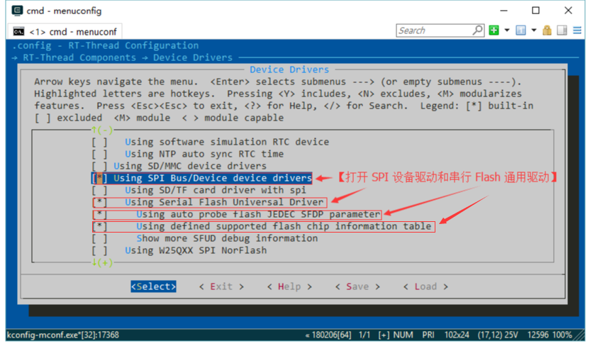

- 为了方便地使用 shell 命令，我们在 `RT-Thread Components → Command shell` 选项中开启 `Using module shell` 选项，如下图所示：

  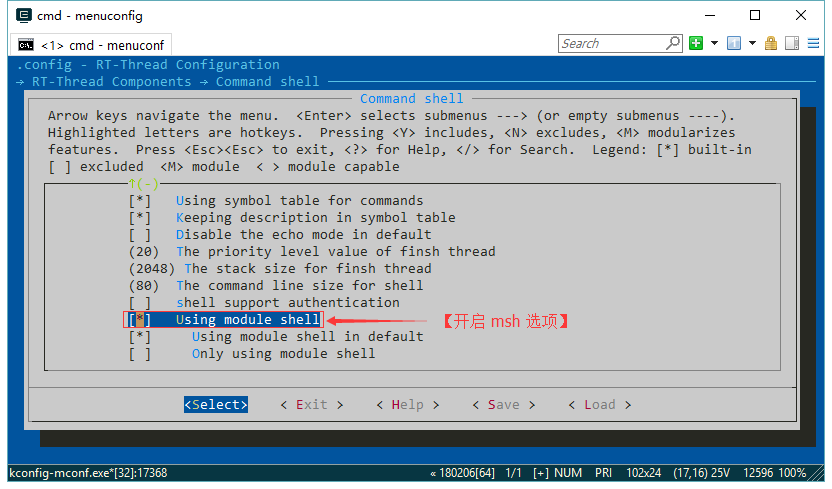

- 保存选项并退出，在 env 中输入命令 `scons --target=mdk5 -s` 生成 mdk5 工程，编译并下载程序。

##### 检查存储设备驱动 #####

- 在 stm32f429-apollo 开发板上 ` SPI Flash`  挂在了 SPI5 总线上，对应的 `SPI Device` 的设备名为 `spi50`。在终端输入 `list_device` 命令可以看到名为 `spi50` 的设备类型为 `SPI Device`，就说明 SPI 设备添加成功。如果没有出现相应的设备，则需要检查驱动程序，查找错误。

  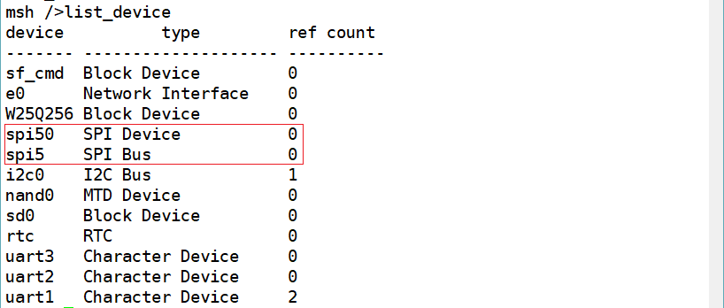

- 为了确保该驱动工作正常，可以使用 `sf` 命令对该设备做 `benchmark` 测试。该功能由 `sfud` 组件提供，可以通过检查存储设备的读、写和擦除功能来判断存储设备的驱动程序是否正常。 如果像下图一样提示成功，所示则认为该驱动工作正常。如果无法通过测试，则需要检查驱动程序，使用逻辑分析仪对存储设备的接口波形进行分析。测试过程如下图：

  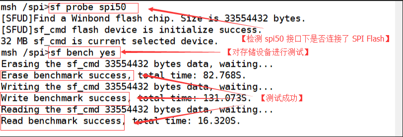

##### 创建存储设备 #####
- 由于只有块设备类型的设备才能和文件系统对接，所以需要根据 `SPI Device` 找到 `SPI Flash` 设备，并创建与其对应的 `Block Device`。

- 这里需要使用到万能 SPI Flash 驱动库：[SFUD](https://github.com/armink/SFUD) ，RT-Thread 已经集成了该组件，在上面的配置过程中我们已经开启这个功能。此时只需要使用 SFUD 提供的 `rt_sfud_flash_probe` 函数即可。该函数将执行如下操作：

  - 根据名为 `spi50` 的 `SPI Device` 设备找到对应的 `Flash` 存储设备。

  - 初始化 `Flash` 设备。

  - 在 Flash 存储设备上创建名为 `W25Q256` 的  `Block Device`。

- 如果开启了组件自动初始化功能，该函数会被自动执行，否则需要手动调用运行。

```c
static int rt_hw_spi_flash_with_sfud_init(void)
{
    if (RT_NULL == rt_sfud_flash_probe("W25Q256", "spi50"))
    {
        return RT_ERROR;
    };

	return RT_EOK;
}
INIT_COMPONENT_EXPORT(rt_hw_spi_flash_with_sfud_init)
```

- 在终端输入 `list_device` 命令如果看到名为 `W25Q256` 的设备类型为 `Block Device`，这说明块设备已经创建成功，如果失败则需要对 `spi50` 设备进行检查。

    如下图所示：

    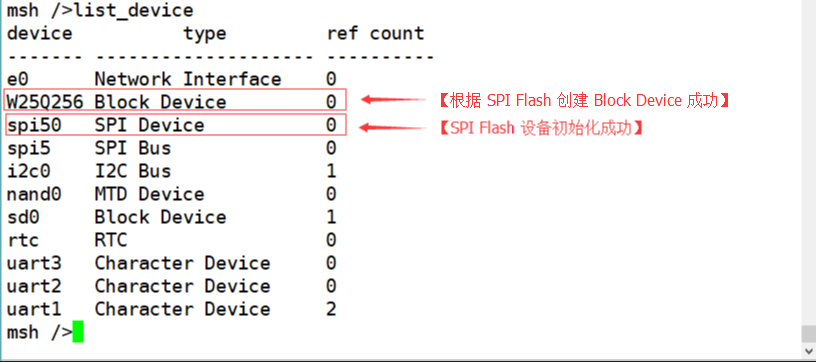

- 获得可以用于挂载的块类型设备，那么移植的工作就算完成了。

### 文件系统的使用 ###

#### 文件系统的初始化 ####

RT-Thread 文件系统初始化过程一般按以下流程来进行：

1. 初始化 DFS 框架
2. 初始化具体文件系统
3. 初始化存储设备

下面我们按照这样的顺序来逐步讲解文件系统的初始化过程：

##### DFS 框架的初始化 #####

DFS 框架的初始化主要是对内部数据结构以及资源的初始化。这一过程包括初始化文件系统必须的数据表，以及互斥锁。该功能由如下函数完成。如果开启了组件自动初始化功能，该函数会被自动执行，否则需要手动调用运行。

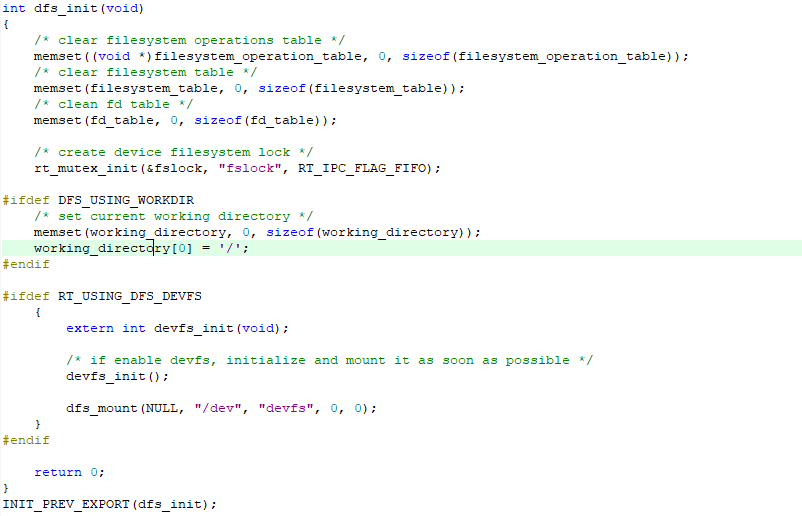

##### 中间层文件系统的初始化 #####

这一步的初始化主要是将 `elm FatFS` 的操作函数注册到 DFS 框架中。该功能由如下函数完成。如果开启了组件自动初始化功能，该函数会被自动执行，否则需要手动调用运行。


##### 存储设备的初始化 #####

存储设备的初始化可以参考 [《创建存储设备》](#_14)章节。

#### 创建文件系统 ####

- 第一次使用 `SPI Flash` 作为文件系统地存储设备时，如果我们直接重启开发板来挂载文件系统，就会看到 `spi flash mount to /spi failed!` 的提示。这是因为此时在 SPI Flash 中还没有创建相应类型的文件系统，这就用到了创建文件系统 shell 命令：`mkfs`。

- `mkfs` 命令的功能是在指定的存储设备上创建指定类型的文件系统。使用格式为：`mkfs [-t type] device` 。第一次挂载文件系统前需要使用 `mkfs` 命令在存储设备上创建相应的文件系统，否则就会挂载失败。如果要在 `W25Q256` 设备上创建 `elm` 类型的文件系统，就可以使用 `mkfs -t elm W25Q256` 命令，使用方法如下图： 

  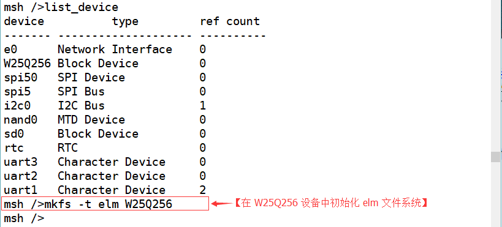
  
- 文件系统创建完成后需要重启设备。

#### 文件系统的挂载 ####

文件系统的挂载指的是将文件系统和具体的存储设备关联起来，并挂载到某个挂载点，这个挂载点即为这个文件系统的根目录。在下面的示例中，我们将 `elm FatFS` 文件系统和名为 `W25Q256` 的存储设备关联起来，并且挂载到 `/spi` 文件夹中。（这里可以挂载到 `/spi` 文件夹的原因是 `stm32f429-apollo BSP` 的文件系统根目录已经挂载了 `RomFS`，并且已经创建了 `/spi` 文件夹。如果没有特殊情况，文件系统可以直接挂载到根目录 `/` 上。）

- 挂载文件系统的操作由 `dfs_mount()` 函数完成，`dfs_mount()`  函数的参数分别为：块设备名、文件系统挂载点路径、挂载文件系统类型、读写标志位以及文件系统的私有数据，使用方法如下图所示：

  

- 经过了上面的创建文件系统操作，我们重启开发板（会自动重新执行挂载函数），就可以成功地挂载文件系统了。可以看到提示 `spi flash mount to /spi !` 。这时再次使用 `list_device` 命令可以看到 `W25Q256` 设备已经被挂载成功。如下图所示：

  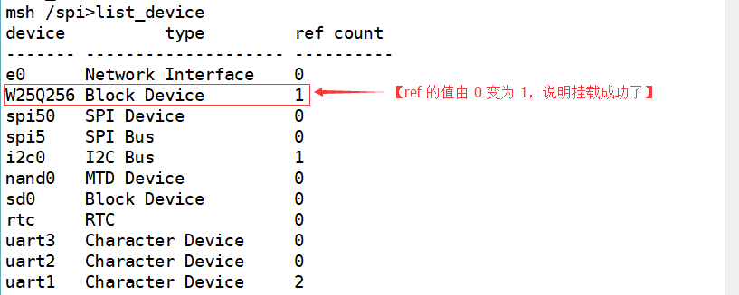

- 到这一步为止，文件系统已经初始化完成，接下来可以对文件和目录进行操作了。

#### 文件与目录操作 shell 命令 ####

在这一小节介绍关于文件和目录操作常用的 shell 命令：

- **ls**   
    功能：显示文件和目录的信息，示例如下图：  
    

- **cd**  
    功能：切换到指定工作目录，示例如下图：  
    

- **cp**  
    功能：copy 文件，示例如下图：  
    

- **rm**  
    功能：删除文件或目录，示例如下图：  
    

- **mv**  
    功能：将文件移动位置或者改名，示例如下图：  
    

- **echo**  
    功能：将指定内容写入文件：  
    

- **cat**  
    功能：展示文件的内容，示例如下图：  
    

- **pwd**  
    功能：打印出当前目录地址，示例如下图：  
    

- **mkdir**  
    功能：创建文件夹，示例如下图：  
    

### 文件操作示例  ###

本节以创建文件夹操作为例，介绍如何使用 RT-Thread 文件系统 Sample 来对文件系统进行操作。

- 在 `menuconfig` 配置界面依次选择 `RT-Thread online packages → miscellaneous packages → filesystem sample options`，选中  `[filesystem] mkdir` 选项，如下图所示：

  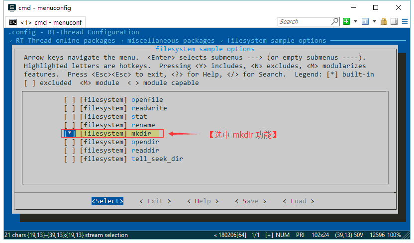

- 保存并退出后，使用 `pkgs --update` 命令更新软件包，然后使用 `scons --target=mdk5 -s` 命令重新生成工程。可以看到该 Sample 已经添加到工程中：

  

- 这里需要注意的是由于我们文件系统的根目录挂载了 `RomFS`，不可修改，所以我们不能直接在根目录创建文件夹。因此，我们需要对程序进行简单的修改，如下图所示：

  

- 重新编译后下载运行，在 msh 中可以使用 `mkdir_sample_init` 命令来创建 web 文件夹，效果如下图所示：

  

- 此时切换到 `/spi` 文件夹中可以看到 web 文件夹已经被创建。

  

- 文件系统提供的 Sample 还有 `openfile`、`readwrite`、`stat`、`rename`、`opendir`、`readdir` 、
  `tell_seek_dir`，大家可以用上面的方法来使用这些功能。

## 常见问题 ##

1.发现文件名或者文件夹名称显示不正常怎么办？

- 检查是否开启了长文件名支持，可以参考本应用笔记[《文件系统的配置》](#_11)章节。

2.文件系统初始化失败怎么办？

- 检查文件系统配置项目中的允许挂载的文件系统类型和数量是否充足。

3.创建文件系统 `mkfs` 命令失败怎么办？

- 检查存储设备是否存在，如果存在检查设备驱动是否可以通过功能测试，如果不能通过，则检查驱动错误。
- 检查 libc 功能是否开启，参见 [《文件系统的配置》](#_11)章节。

4.文件系统挂载失败怎么办？

-  检查指定的挂载路径是否存在。文件系统可以直接挂载到根目录（“/”），但是如果想要挂载到其他路径上，如 （“/sdcard”）。需要确保（“/sdcard”）路径是存在的，否则需要先在根目录创建 `sdcard` 文件夹才能挂载成功。
-  检查是否在存储设备上创建了文件系统，如果存储设备上没有文件系统，需要使用 `mkfs` 命令在存储器上创建文件系统。

5.SFUD 探测不到 Flash 所使用的具体型号怎么办？

- 检查硬件引脚设置错误
- SPI 设备是否已经注册
- SPI 设备是否已经挂载到总线
- 检查在 `RT-Thread Components → Device Drivers -> Using SPI Bus/Device device drivers -> Using Serial Flash Universal Driver` 菜单下的 `Using auto probe flash JEDEC SFDP parameter` 和 `Using defined supported flash chip information table` 配置项是否选中，如果没有选中那么需要开启这两个选项。配置图可参考 [《开启 SPI 设备驱动》](#spi) 章节。
- 如果开启了上面的选项仍然无法识别存储设备，那么可以在 [SFUD](https://github.com/armink/SFUD) 项目中提出 issues。

6.elm FatFS 的最大扇区大小该如何设置？

- 根据所使用的存储设备的不同，也会有些不一样，一般根据 Flash 设备的要求可以设置为 4K，也就是填写 4096。
- 一般常见的 TF 卡和 SD 卡的扇区大小设置为 512。

7.存储设备的 `benchmark` 测试耗时过长是怎么回事？

- 可对比 `system tick` 为 1000 时的 [benchmark 测试数据](https://github.com/armink/SFUD/blob/master/docs/zh/benchmark.txt) 和本次测试所需的时长，如果耗时差距过大，则可以认为测试工作运行不正常。

- 检查系统 tick 的设置，因为一些延时操作会根据 tick 时间来决定，所以需要根据系统情况来设置合适的 `system tick` 值。如果系统的 `system tick` 值不低于 1000，则需要使用逻辑分析仪检查波形确定通信速率正常。

8.SPI Flash 实现 elmfat 文件系统，如何保留部分扇区不被文件系统使用？

- 可以使用 RT-Thread 提供的 [partition](https://github.com/RT-Thread-packages/partition) 工具软件包为整个存储设备创建多个块设备，为创建的多个块设备分配不同的功能即可。

9.测试文件系统过程中程序卡住了怎么办？

- 尝试使用调试器或者打印一些必要的调试信息，确定程序卡住的位置再提出问题。

10.如何一步步检查文件系统出现的问题？

- 可以采用从底层到上层的方法来逐步排查问题。
- 首先检查存储设备是否注册成功，功能是否正常。
- 检查存储设备中是否创建了文件系统。
- 检查指定文件系统类型是否注册到 DFS 框架，经常要检查允许的文件系统类型和数量是否足够。
- 检查 DFS 是否初始化成功，这一步的初始化操作是纯软件的，因此出错的可能性不高。需要注意的是如果开启了组件自动初始化，就无需再次手动初始化。

## 参考 ##

### 本文所有相关的API ###

#### API列表 ####
| 文件系统初始化相关API        | 位置          |
| ---------------------- | ------------- |
| dfs_init() | dfs.c |
| elm_init() | dfs_elm.c |
| dfs_mount() | dfs_fs.c |

| shell命令相关API   | 位置          |
| ---------------------- | ------------- |
| cmd_cat()    | msh_cmd.c |
| cmd_rm() | msh_cmd.c |
| cmd_cd() | msh_cmd.c |
| cmd_cp() | msh_cmd.c |
| cmd_mv() | msh_cmd.c |
| cmd_rm() | msh_cmd.c |
| cmd_pwd() | msh_cmd.c |
| cmd_mkdir() | msh_cmd.c |
| cmd_mkfs() | msh_cmd.c |

#### 核心API详解 ####
##### dfs_init() #####
**函数功能**:
- 初始化 RT-Thread 文件系统 DFS 框架。

**函数原型**:
```{.c}
int dfs_init(void)
```

**函数返回**：  成功返回 RT_EOK。

##### elm_init() #####
**函数功能**:
- 注册 FatFS 到 DFS 框架。

**函数原型**:
```{.c}
int elm_init(void)
```

**函数返回**：  成功返回 RT_EOK。

##### dfs_mount() #####
**函数功能**:
- 在指定路径挂载特定类型的文件系统。

**函数原型**:
```{.c}
int dfs_mount(const char   *device_name,
              const char   *path,
              const char   *filesystemtype,
              unsigned long rwflag,
              const void   *data)
```

参数 | 描述
- | -
device_name | 包含文件系统的块设备名 
path | 文件系统挂载点路径 
filesystemtype | 需要挂载的文件系统类型 
rwflag | 读写标志位 
data | 该文件系统的私有数据 

**函数返回**： 成功返回 RT_EOK，失败则返回 -1。
